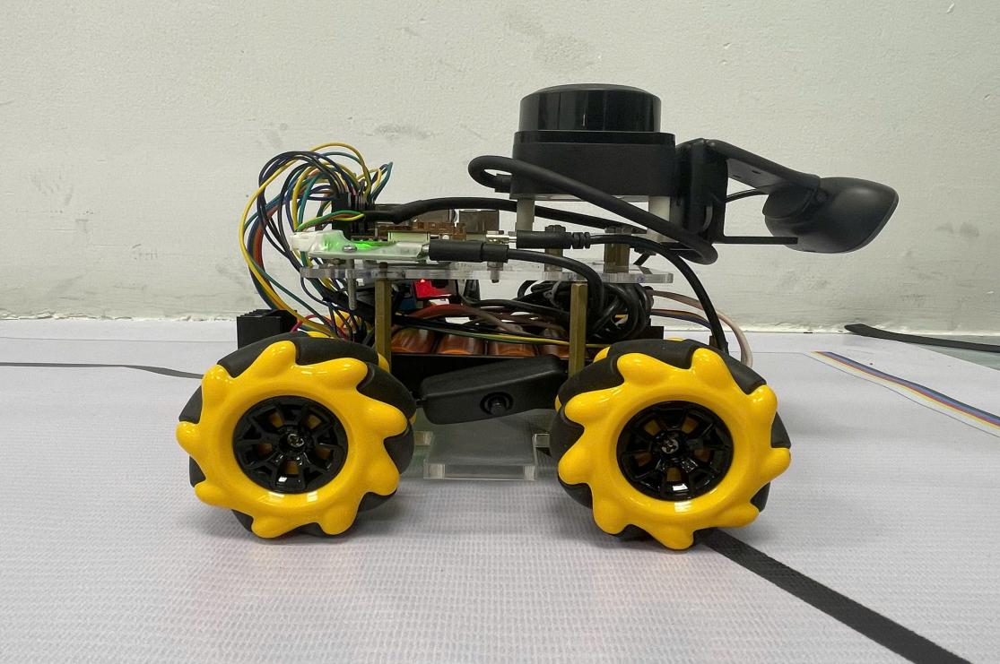
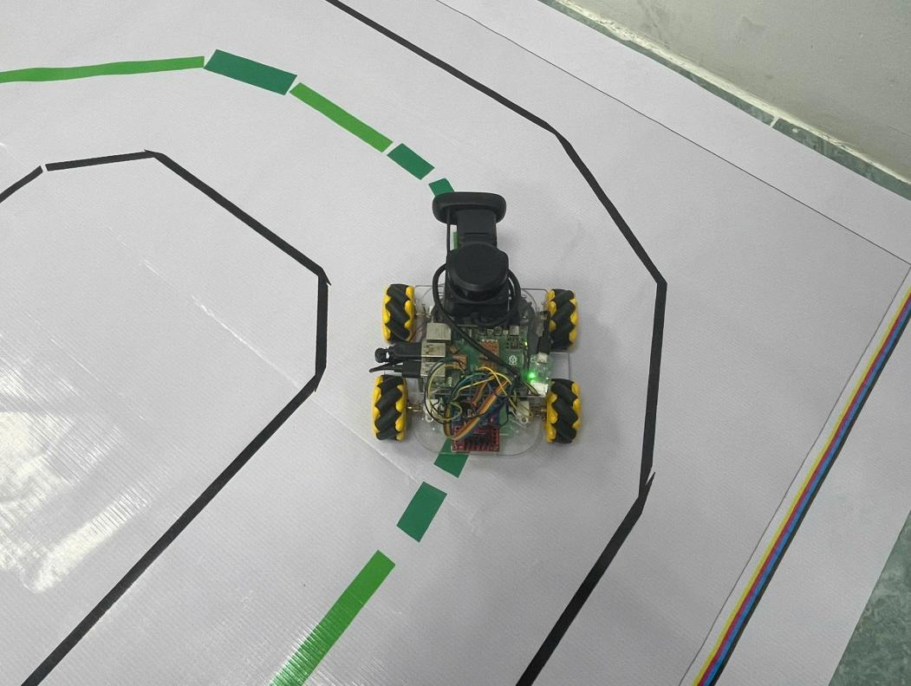
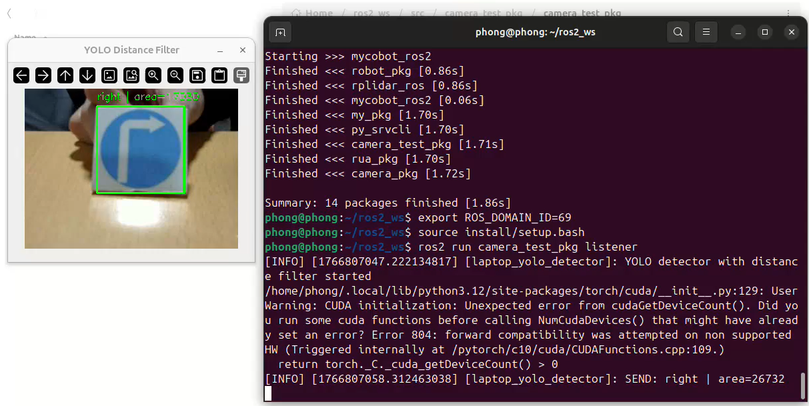
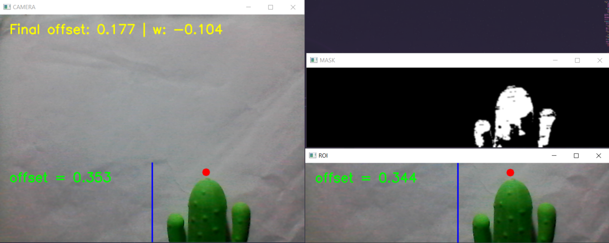
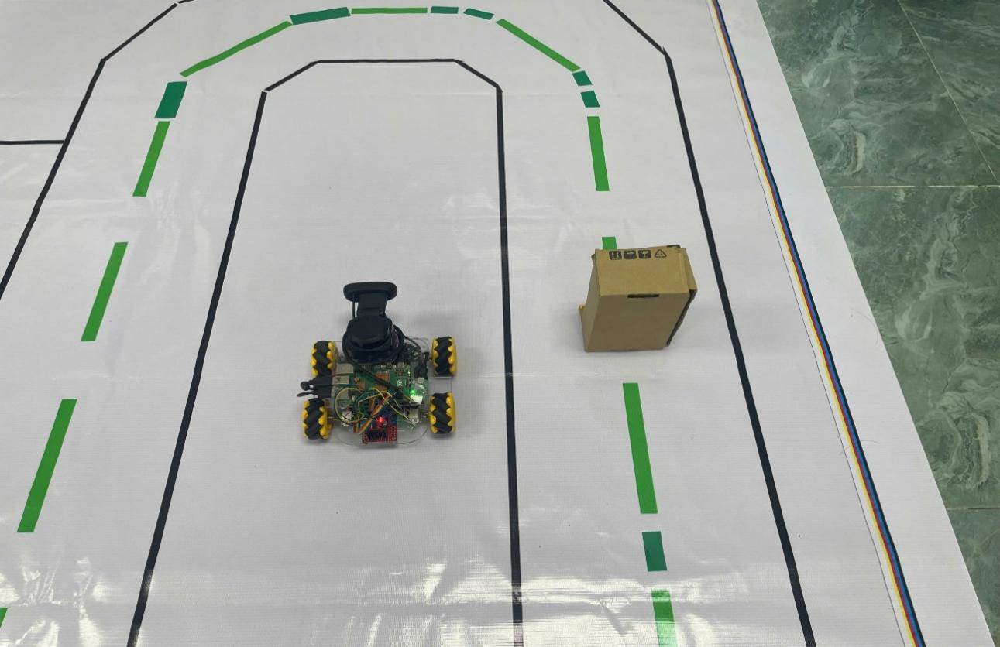
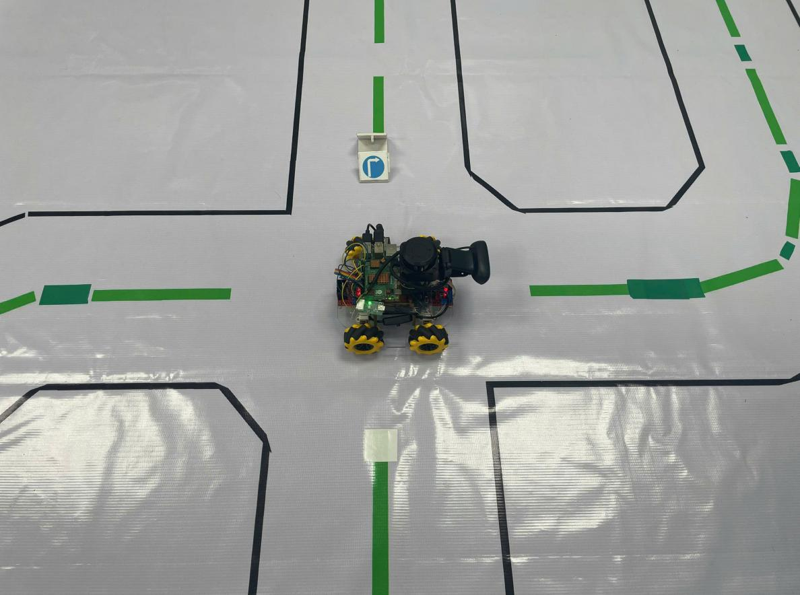

# 🚗 Autonomous Four-Wheel Omnidirectional Robot Using LiDAR and Computer Vision

A 4-wheeled Mecanum robot that integrates LiDAR sensing and camera-based vision for intelligent autonomous navigation — including green line following, traffic sign recognition, and obstacle avoidance.



---

## 📌 Overview

This project addresses a core challenge in autonomous vehicle systems: **no single sensor is sufficient on its own.**

- **LiDAR** is accurate for 3D mapping and obstacle detection — but lacks semantic understanding.
- **Camera + CV** can follow lanes and detect objects — but is sensitive to lighting and environment.

By fusing both, this robot can simultaneously **follow a lane**, **avoid obstacles**, and **obey traffic rules** in real time.

---

## 🎯 Objectives

- Design and build a smart 4-wheeled Mecanum robot
- Integrate LiDAR (C1M1) for spatial scanning and obstacle avoidance
- Use a camera (C270) + YOLOv8n for real-time object and sign detection
- Deploy the full pipeline on a Raspberry Pi 5 for edge inference

---

## 🛠️ Hardware Components

| Component | Role |
|---|---|
| Raspberry Pi 5 | Central processing unit |
| LiDAR C1M1 | Spatial scanning & obstacle detection |
| Logitech C270 Camera | Lane detection & object recognition |
| Mecanum Wheels (60mm) | Omnidirectional movement |
| DC Servo Motor GA12 N20 | Wheel actuation |
| H-Bridge L298N | Motor driver |
| Li-ion 18650 Battery | Power supply |
| Buck Converter XL4015 | Voltage regulation |

---

## 🟢 Line Following

The robot detects a green line on the ground using HSV color masking and follows it using a PID controller.



- Camera captures frames and crops the bottom ROI
- HSV mask isolates the green line
- PID controller steers the robot to stay centered

---

## 🔍 Object Detection

The camera feed is processed using OpenCV to detect and classify objects in the robot's path.



- YOLOv8n model runs on Raspberry Pi 5
- Detects traffic signs and obstacles in real time
- Feeds detection results into the control decision engine

---

## 📐 Lane Offset Correction

When the robot drifts off center, the vision system calculates the offset and corrects steering automatically.



- Green line centroid is compared to frame center
- Offset error is fed into the PID controller
- Wheels adjust to bring the robot back on track

---

## 🔄 Obstacle Avoidance (Dodge)

When LiDAR detects an obstacle, the robot executes a lateral dodge maneuver and resumes lane following.



```
Obstacle detected by LiDAR
        │
        ▼
Move sideways (left)
        │
        ▼
Move forward (past obstacle)
        │
        ▼
Move back to lane (right)
        │
        ▼
Resume line following
```

---

## ↩️ Turn Execution

The robot can execute precise 90° turns at intersections using encoder-based odometry.



- Wheel encoders count ticks to measure rotation angle
- Robot rotates in place until 90° is reached
- Resumes forward movement after turn completes

---

## 💻 Software Stack

- **YOLOv8n** — Real-time object detection and classification
- **OpenCV** — HSV color masking, contour detection, lane offset calculation
- **LiDAR data processing** — Obstacle mapping and safe-distance maintenance
- **PID + PI Controllers** — Smooth steering and wheel speed control
- **Mecanum Inverse Kinematics** — Converts velocity commands to wheel PWM signals
- All deployed on **Raspberry Pi 5** for real-time edge processing

---

## 📁 Project Structure

```
├── README.md
├── 10_finalEverything.py       ← Full integrated system
│
├── camera/
│   ├── README.md
│   ├── 4_CameraTest.py         ← Camera stream viewer
│   ├── 5_CamWheel.py           ← Camera + line following
│   ├── 8_TurnTest.py           ← 90° turn calibration
│   └── 9_FinalTurn.py          ← Line follow + obstacle avoid
│
├── lidar/
│   ├── README.md
│   ├── 6_DodgeTest.py          ← Standalone dodge test
│   └── 7_DodgeMove.py          ← Dodge + line following
│
├── motor_control/
│   ├── README.md
│   ├── 1_ECheck.py             ← Encoder check
│   ├── 2_DeadBandAuto.py       ← Dead band calibration
│   ├── 3_PIDKickStart.py       ← PID tuning
│   ├── ECounter.py             ← Encoder counter
│   ├── ECSimple.py             ← Simple encoder test
│   └── TestDirection.py        ← Motor direction test
│
└── images/
    ├── FullModel.png
    ├── FollowLane.png
    ├── ObjectDetect.png
    ├── OpenCVOffsetToCenter.png
    ├── Dodge.png
    └── Turn.png
```

---

## ⚠️ Limitations

- Tested in a **controlled small-scale environment** only; not validated in real traffic
- Camera performance degrades in **low-light** conditions
- LiDAR cost and outdoor durability remain areas for improvement

---

## 🌐 Practical Applications

- Automated goods transport in warehouses or factories
- AI-powered smart traffic systems
- Research and education platform for autonomous vehicle development